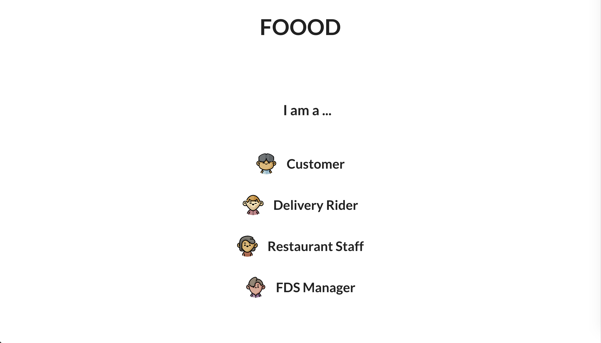
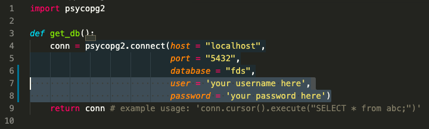

# Food-Delivery-Service-App
## CS2102 Project

Team Members:
Chen Hui, Jason Sathya Citro, Lim Jun Kuang Lionel, Lin Yuting

### Introduction


A Food Delivery Service App for Customers, Delivery Riders, Restaurant Staff and FDS Manager.

<p align = 'center'>
</a>
</p>
<p align = 'center'><b>Home page</b></p>

<br>

### Database

<p align = 'center'>
</a>
</p>
<p align = 'center'><b>Entity Relationship Diagram</b></p>

View our full <a href = "https://docs.google.com/document/d/1HUFeItMpadIYxsP9MCqp_tO5W4i78-vbBEFaCuCZOHk/edit?usp=sharing">project report </a> for more detailed information

The database has been loaded with randomised and correct data exceeding 120,000 orders.


## Tools

-   ReactJS
-   Axios
-   Flask
-   psycopg2
-   PostgreSQL

## Setup

Requirements: Have <a href = "https://www.postgresql.org/download/">PostgreSQL</a> installed

1. Clone the repo.

```sh
git clone https://github.com/jascxx/Food-Delivery-Service-App.git
```

2. Change directory to frontend. Install NPM Packages.

```sh
cd frontend
npm install
```

3. Start the React Web App. This starts the web client on <b>localhost:3000</b>.

```sh
npm start
```

4. Change directory to webservice and install flask and psycopg2 packages.

```sh
cd ../webservice
pip3 install flask
pip3 install psycopg2==2.7.6
```

5. Run webserver.
```sh
python3 app.py
```

6. Change directory to csvGenerator and generate csv data.
```sh
cd csvGenerator
python3 init_customers_users.py
python3 generate_orders.py
```
6. Allow some time to load the data. (No longer than 30 seconds) 

1. Change directory to backend. Run psql on localhost on port 5432.
2. You need to supply your own username and password for psql.

```sh
cd ../../backend
psql -h localhost -p 5432 --u [username]
[input password]
```

9. Create database and connect to database.

```sh
CREATE DATABASE fds;
\c fds
```

10. Initialise data. (Make sure you are at backend directory)
```sh
\i init.sql
```
11. Allow some time to load the data. (No longer than 30 seconds) 

12.  FDS should now be operating. If the database is initialized correctly, you should be able to login with existing accounts or create a new account. Existing accounts all have username as their password. You may try logging in using the sample accounts listed below which have data pre-loaded.

```sh
Sample Customer UserID: Emma
Sample Customer password: Emma
```

13. If you tried to register on localhost:3000 but failed, go to webservice/db.py and manually type in your psql username and password there, as shown in the picture below.

```sh
cd webservice/db.py
```
</a>